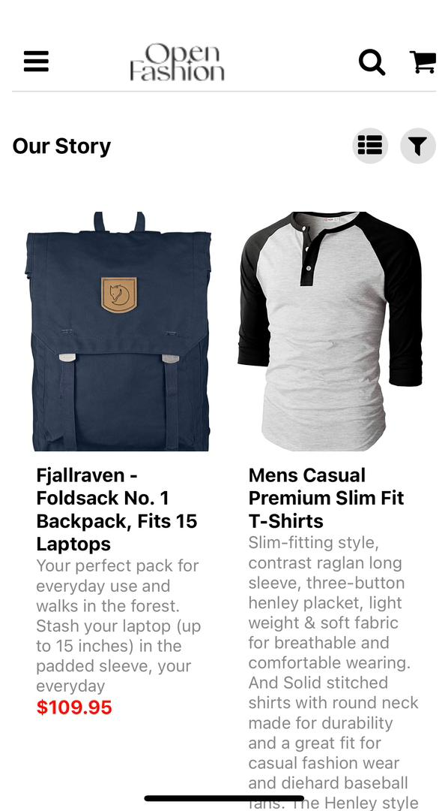
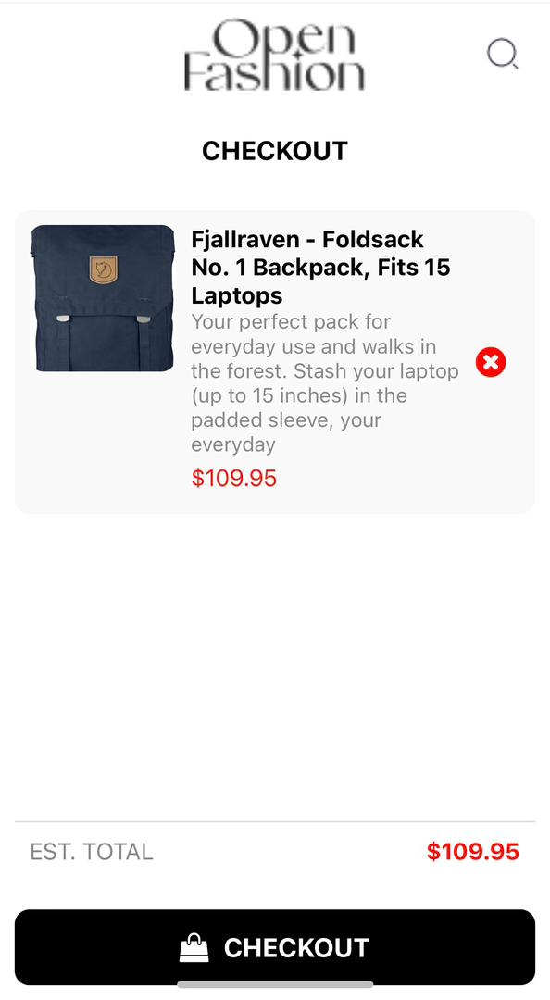
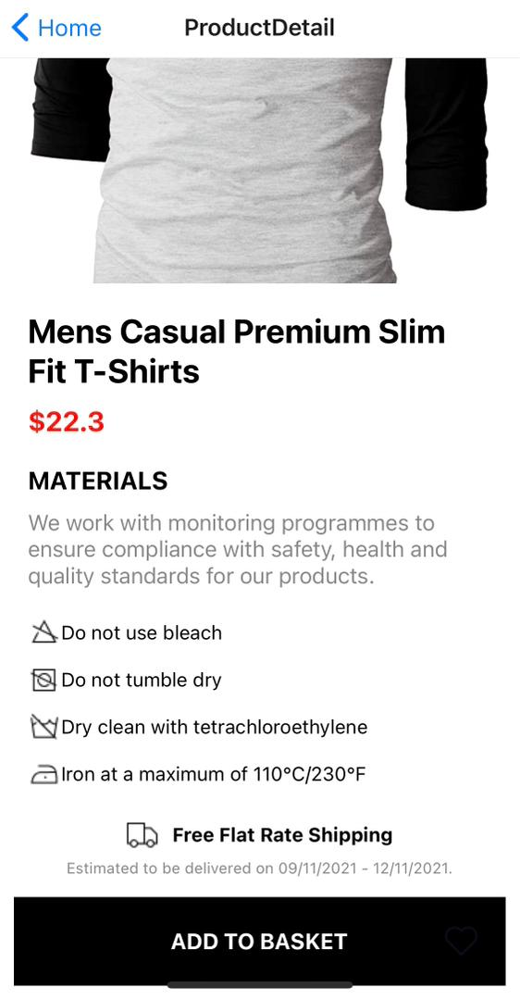

# rn-assignment7-11356915
Here’s a summary of the components and their functionality in your React Native online shopping application:

### 1. **App Structure**
- **Main Components**:
  - `App`: The root component of the application. It sets up the `NavigationContainer` and provides context for managing the cart.
  - `Drawer.Navigator`: Used for the side drawer navigation.
  - `Stack.Navigator`: Manages the stack of screens for the app, allowing navigation between them.

### 2. **Context**
- **CartContext**: 
  - Provides the cart state and functions to add and remove items from the cart.
  - `CartProvider`: A context provider that wraps the application components, giving them access to cart state and functions.

### 3. **Screens**
- **HomeScreen**:
  - Displays a list of products fetched from an API.
  - Allows users to navigate to product details and checkout screens.
  - Includes a header with navigation buttons, a logo, and a cart icon showing the number of items in the cart.
  - Displays product details in a grid format, with options to add or remove items from the cart.

- **CheckoutScreen**:
  - Shows items added to the cart.
  - Displays the total price of items in the cart.
  - Provides a button to proceed with the checkout process.

- **ProductDetailScreen**:
  - Displays detailed information about a selected product, including its image, title, price, and material details.
  - Shows care icons for the product.
  - Provides a button to add the product to the basket.

### 4. **Navigation**
- **DrawerContent**:
  - Custom content for the side drawer navigation.
  - Includes buttons to navigate to various sections of the app like Store, Locations, Blog, Jewelry, Electronic, and Clothing.

### 5. **Design and Styles**
- **Stylesheets**:
  - Each screen and component includes styles defined using `StyleSheet.create` to ensure consistent and responsive design across the app.

### 6. **Icons and Images**
- **react-native-vector-icons/FontAwesome**: Used for icons in various parts of the app.
- **Images**: Includes custom images like logos and care icons to enhance the UI.

### 7. **Fetching Data**
- **API Calls**: 
  - Fetches product data from `https://fakestoreapi.com/products`.
  - Uses `useEffect` to fetch data when the `HomeScreen` component mounts.

This summary provides a high-level overview of the components and their functionalities in your React Native online shopping application. The structure ensures clear navigation, state management for the cart, and an organized layout for displaying products and details.

